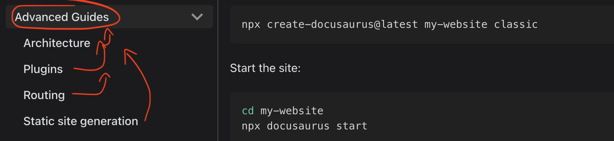
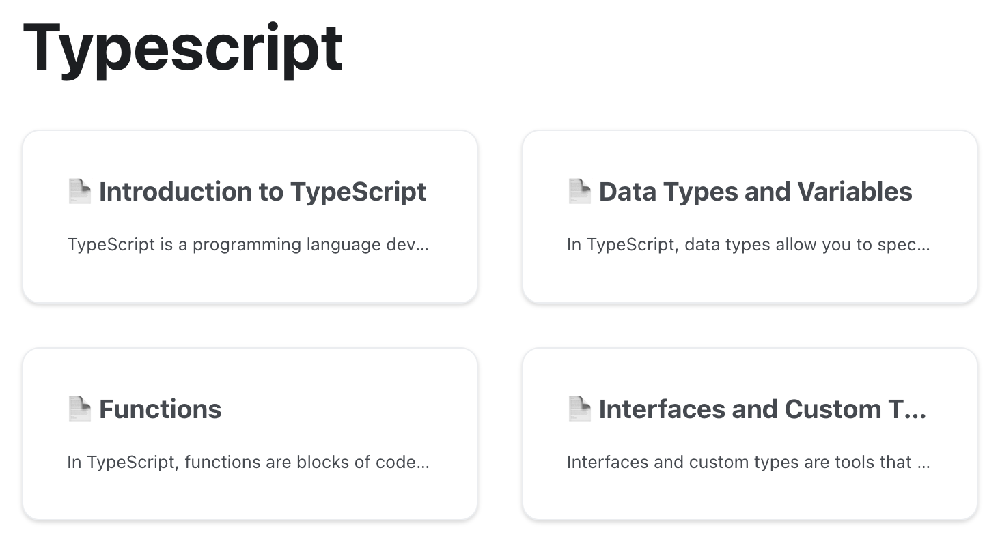

# How to Collab

Yes, it's an open-source project, created with ❤️ for developers by developers.

**If you are familiar with a technology, you can collaborate.**

## Steps

***

1. Choose the technology you want to write about.
2. Fork the repository **[NGOD here](https://github.com/joaquinmetayer/NGOD)**.
3. Create a branch with your name.
4. Add or modify documentation following the documentation patterns.
5. Submit a pull request to the master branch.
6. Share this on LinkedIn.

## Documentation Pattern

***

The NGOD site is created with **[Docusaurus](https://docusaurus.io/)**, a React-based framework that supports **Markdown files**.

Refer to the Markdown guide **[here](https://www.markdownguide.org/)**.

**The easiest way to learn how to do this is by reviewing the **[GitHub repository](https://github.com/joaquinmetayer/NGOD)** and following the pattern.**

### Setting up the Environment

***

1. Fork the **[GitHub repository](https://github.com/joaquinmetayer/NGOD)**.
2. Open the project in your IDE and run ``npm i`` and ``npm start``.
3. You're ready to collaborate.

### Adding a Category

***

1. Create a new folder within the ``docs`` directory with the name of the category. For example, if the category name is "Advanced Guides," the folder name should be ``advanced-guides``.



2. Inside the category folder, create a file named ``_config_.json`` with the following structure (copy and paste the example):

```json
{
  "label": "Advanced Tutorials",
  "position": 1, // position in the categories
  "link": {
    // This description shows inside the category
    "description": "This section will not be highly structured, but we will cover the following topics:"
  }
}
```

The ``.md`` and ``.mdx`` files will automatically be displayed as cards within the category, like this:



### Adding a Page

***

1. Create your Markdown files.

Create a file within the ``category folder`` and insert the following structure into the file:

```js
---
sidebar_position: 1 // position to show in sidebar within the category
---

# Architecture // title to show in sidebar

// ... all the documentation content
```

In the end, your app files will look like this:

```
docs
├── img
├── advanced-guides.md
│   └── _category_.json
│   └── architecture.md
│   └── plugins.md
│   └── routing.md
│   └── static-site-generation.md
└── how-to-collab.md
└── getting-started.md
```

### Content in the Documentation

***

A simple and structured approach is as follows:

1. Choose a category for the technology, such as Angular, React, C#, NodeJS, Patterns, etc.
2. Within the category, insert the relevant ``.md`` files.
3. In the Markdown files, explain a specific topic related to the category, such as Angular CLI, Routes, Directives, etc.

***

Remember... the easiest way to learn how to do this is by reviewing the **[GitHub repository](https://github.com/joaquinmetayer/NGOD)** and following the pattern.