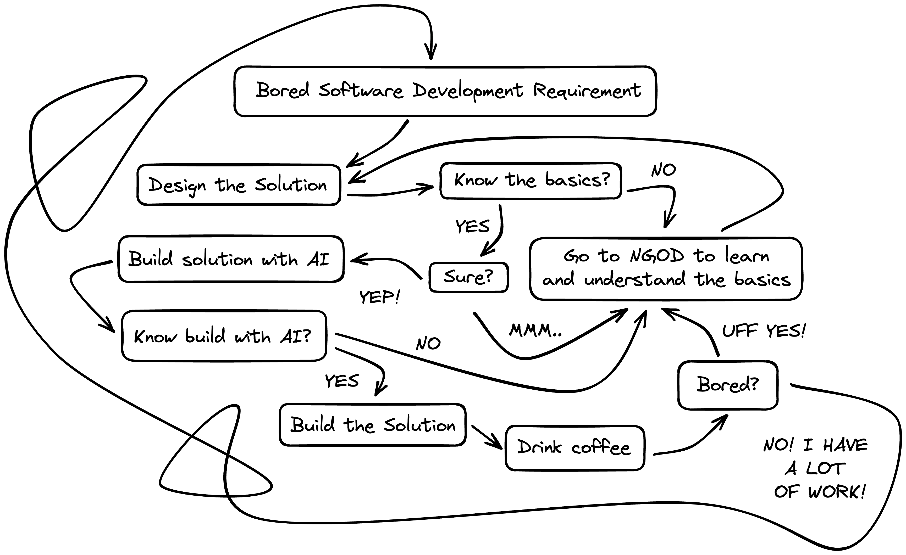

# User guide

A simple guide to building high-quality software with AI helps (this is not the AI; it's a guide) that provides all the basics you need.

Say goodbye to boring and lengthy documentation. Here, you will find the fundamentals for building high-quality software with artificial intelligence. If you need any code, the AI will guide you step by step. However, the important thing in software development is to understand how things work, how to build and connect all the software components, and so on, in order to solve the problem —not just memorize how to code my entire app.

- **Learn software architecture.**
- **Learn the basics of each solution, tool, and technology.**
- **Specialize in one stack.**
- **Need step-by-step guidance? Ask the AI.**

Build good and fast. Enjoy.